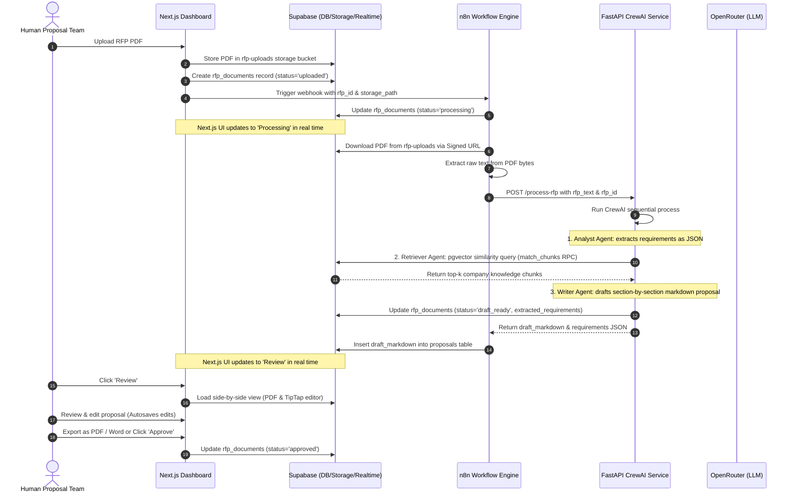

# Autonomous B2B RFP Response Architect

The **Autonomous B2B RFP Response Architect** is an enterprise-grade agentic pipeline designed to automate the ingest, analysis, retrieval, and drafting phases of B2B Request for Proposal (RFP) response generation. By combining multi-agent CrewAI orchestration with semantic vector retrieval (RAG) and an n8n workflow engine, this system ingests complex technical RFPs and generates section-by-section, compliance-checked proposal drafts, featuring a real-time Next.js dashboard for human review, editing, and document export.

---

## 🗺️ System Map & Data Flow

Below is the end-to-end architecture and sequence flow of the proposal pipeline:



---

## 🚀 Key Features

* **Multi-Agent Collaboration:** Sequential execution of three specialized CrewAI agents (Requirements Analyst ➔ Technical Retriever ➔ Proposal Writer) powered by OpenRouter LLMs.
* **Semantic RAG Ingestion:** Automatic text chunking, local vector embedding generation (`BAAI/bge-small-en-v1.5`), and ingestion into PostgreSQL via `pgvector` for context-aware answers.
* **Orchestration & Automation:** n8n workflow management connecting Supabase storage uploads, signed URLs, file content extraction, and the AI agent service.
* **Human-in-the-Loop Review Dashboard:** Next.js 14 frontend containing a side-by-side review workspace with the original RFP PDF viewer on the left, and a TipTap markdown editor on the right.
* **Supabase Realtime Synchronization:** Continuous DB updates showing proposal generation states (`uploaded` ➔ `processing` ➔ `draft_ready` ➔ `approved`) instantly without page refreshes.
* **Professional Export Formats:** Download finalized and approved proposals to PDF (using jsPDF & html2canvas) or Microsoft Word format (using docx).

---

## 🛠️ Tech Stack

| Layer | Technologies |
| :--- | :--- |
| **Frontend UI** | Next.js 14+ (App Router), TypeScript, Tailwind CSS, Lucide Icons, GSAP, Sonner |
| **Rich Text Editor** | TipTap (`@tiptap/react`, `@tiptap/starter-kit`, `@tiptap/markdown`) |
| **Backend & DB** | Supabase (PostgreSQL with `pgvector` extension) |
| **Workflow Engine** | n8n (hosted via Docker or local CLI) |
| **Agentic Core** | CrewAI (Python 3.11), FastAPI, Uvicorn, Pydantic v2 |
| **LLMs & Embeddings** | OpenRouter (`auto` LLM routing), HuggingFace `BAAI/bge-small-en-v1.5` (local sentence-transformers) |
| **PDF Extraction** | pdfplumber (Python) |
| **Document Export** | jsPDF, html2canvas, docx |

---

## 📁 Repository Structure

* [AGENTS.md](file:///c:/b2b_rfp/AGENTS.md) — Main specifications, Supabase table schemas, Crew agent roles, and dev conventions.
* [PROJECT.md](file:///c:/b2b_rfp/PROJECT.md) — Original multi-phase project roadmap.
* [WALKTHROUGH.md](file:///c:/b2b_rfp/WALKTHROUGH.md) — Step-by-step setup guides, SQL scripts, API configurations, and testing checklists.
* [docker-compose.yml](file:///c:/b2b_rfp/docker-compose.yml) — Runs n8n local instance.
* [agents/](file:///c:/b2b_rfp/agents) — CrewAI and FastAPI python microservice.
  * [agents/main.py](file:///c:/b2b_rfp/agents/main.py) — FastAPI entrypoint defining `/health` and `/process-rfp`.
  * [agents/crew.py](file:///c:/b2b_rfp/agents/crew.py) — CrewAI orchestration running the sequential workflow.
  * [agents/agents/](file:///c:/b2b_rfp/agents/agents) — Agent prompts and definitions:
    * [analyst.py](file:///c:/b2b_rfp/agents/agents/analyst.py) — Extracts deadline, technical requirements, and compliance.
    * [retriever.py](file:///c:/b2b_rfp/agents/agents/retriever.py) — Queries the Supabase vector database for matching knowledge.
    * [writer.py](file:///c:/b2b_rfp/agents/agents/writer.py) — Synthesizes requirements and company knowledge into markdown.
    * [llm.py](file:///c:/b2b_rfp/agents/agents/llm.py) — OpenRouter client initialization.
  * [agents/tools/vector_search.py](file:///c:/b2b_rfp/agents/tools/vector_search.py) — Supabase RAG database search tool.
  * [agents/ingestion/](file:///c:/b2b_rfp/agents/ingestion) — RAG pipeline parsing, chunking, and embedding generation scripts:
    * [run_ingestion.py](file:///c:/b2b_rfp/agents/ingestion/run_ingestion.py) — Main CLI command to ingest PDF documentation.
    * [generate_pdfs.py](file:///c:/b2b_rfp/agents/ingestion/generate_pdfs.py) — Generates sample PDFs for local testing.
  * [agents/requirements.txt](file:///c:/b2b_rfp/agents/requirements.txt) — Python dependencies list.
* [frontend/](file:///c:/b2b_rfp/frontend) — Next.js TypeScript client.
  * [frontend/app/upload/page.tsx](file:///c:/b2b_rfp/frontend/app/upload/page.tsx) — PDF Upload UI and n8n webhook caller.
  * [frontend/app/proposals/page.tsx](file:///c:/b2b_rfp/frontend/app/proposals/page.tsx) — Proposals real-time status tracker list.
  * [frontend/app/proposals/[id]/review-client.tsx](file:///c:/b2b_rfp/frontend/app/proposals/%5Bid%5D/review-client.tsx) — Rich text proposal editor and PDF viewer client workspace.
  * [frontend/package.json](file:///c:/b2b_rfp/frontend/package.json) — Frontend script commands and packages.
* [n8n/](file:///c:/b2b_rfp/n8n) — Automation orchestrator.
  * [n8n/rfp_workflow.json](file:///c:/b2b_rfp/n8n/rfp_workflow.json) — Exported JSON n8n node pipeline ready for import.

---

## ⚙️ Local Development Setup

To configure the project on your machine, follow these instructions. Detailed setup parameters can be found in the [WALKTHROUGH.md](file:///c:/b2b_rfp/WALKTHROUGH.md).

### 1. Database Setup (Supabase)
Run the following queries in the Supabase SQL editor:
1. Enable `pgvector`:
   ```sql
   create extension if not exists vector;
   ```
2. Create the tables (`rfp_documents`, `proposals`, `knowledge_chunks`) and vector similarity search function `match_chunks`. Find the full SQL script in [WALKTHROUGH.md: Section 4](file:///c:/b2b_rfp/WALKTHROUGH.md#L179-L287).
3. Create a private Storage bucket named `rfp-uploads` to house raw PDF documents.
4. Enable Supabase Realtime replication on the `rfp_documents` table.

### 2. Environment Variables Configuration
Configure the following env files with your API credentials and endpoints:

#### Frontend (`frontend/.env.local`):
```env
NEXT_PUBLIC_SUPABASE_URL=https://your-project-ref.supabase.co
NEXT_PUBLIC_SUPABASE_ANON_KEY=your-supabase-anon-key
SUPABASE_SERVICE_ROLE_KEY=your-supabase-service-role-key
N8N_WEBHOOK_URL=http://localhost:5678/webhook/rfp-upload
```

#### FastAPI Agents Service (`agents/.env`):
```env
OPENROUTER_API_KEY=sk-or-your-key-here
SUPABASE_URL=https://your-project-ref.supabase.co
SUPABASE_SERVICE_ROLE_KEY=your-supabase-service-role-key
```

#### n8n workflow (`n8n/.env`):
```env
SUPABASE_URL=https://your-project-ref.supabase.co
FASTAPI_URL=http://localhost:8000
```
> [!NOTE]
> If running n8n within a Docker container and FastAPI on your host system, set `FASTAPI_URL` to `http://host.docker.internal:8000`.

### 3. Dependency Installation & Dev Servers Startup

Open three separate terminals to launch the different parts of the system:

#### Terminal 1: Agents API (Python)
Ensure Python 3.11 is installed, then set up the virtual environment:
```powershell
cd C:\b2b_rfp\agents
python -m venv venv
.\venv\Scripts\Activate.ps1
python -m pip install --upgrade pip
pip install -r requirements.txt
uvicorn main:app --host 0.0.0.0 --port 8000 --reload
```
You can verify the API is running by loading the `/health` endpoint:
```powershell
curl http://localhost:8000/health
# Expected output: {"status":"ok"}
```

#### Terminal 2: n8n Workflow Engine
Start n8n using Docker compose:
```powershell
cd C:\b2b_rfp
docker compose up n8n
```
Log in at `http://localhost:5678`, select **Import from File**, upload [n8n/rfp_workflow.json](file:///c:/b2b_rfp/n8n/rfp_workflow.json), configure the Supabase database connection and HTTP Authorization headers, and activate the workflow.

#### Terminal 3: Next.js Frontend
```powershell
cd C:\b2b_rfp\frontend
npm install
npm run dev
```
Open `http://localhost:3000` to view the running dashboard interface.
> [!TIP]
> If PowerShell blocks `npm`, run script commands using the command prompt wrapper directly: `npm.cmd run dev` and `npm.cmd run build`.

---

## 🗂️ Knowledge Base Ingestion (RAG)

Before generating proposals, ingest past company documents and technical details into the vector database.

1. (Optional) Run the PDF generator to produce mock documentation:
   ```powershell
   cd C:\b2b_rfp\agents
   .\venv\Scripts\Activate.ps1
   python ingestion\generate_pdfs.py
   ```
2. Run the ingestion command pointing to your company documents:
   ```powershell
   python ingestion\run_ingestion.py --file "ingestion\Company_Technical_Profile.pdf" --category technical --source-doc "Company Profile"
   python ingestion\run_ingestion.py --file "ingestion\Security_Compliance_Playbook.pdf" --category security --source-doc "Security Playbook"
   python ingestion\run_ingestion.py --file "ingestion\Past_Performance_Case_Studies.pdf" --category past_rfp --source-doc "Case Studies"
   ```

Verify rows are populated in Supabase SQL editor:
```sql
select count(*) from public.knowledge_chunks;
```

---

## 🔬 Verification & Testing Flow

For a full end-to-end verification check:
1. Access `http://localhost:3000/upload` and upload `ingestion\RFP_Acme_Corp_Cloud_Modernization.pdf`.
2. Confirm the document was created in the database and saved to the `rfp-uploads` storage bucket.
3. Check n8n Executions to trace the PDF download, text extraction, and the POST request to `/process-rfp`.
4. Follow the FastAPI logs to watch the CrewAI agents execute sequentially.
5. In the browser, verify that `http://localhost:3000/proposals` transitions from `uploaded` ➔ `processing` ➔ `draft_ready` automatically via Supabase Realtime updates.
6. Click **Review** on the dashboard card, verify the PDF is displayed on the left and the generated TipTap proposal editor is populated on the right.
7. Edit any text section, wait 30 seconds, and confirm the document autosaved (and increments the version counter).
8. Click **Export** to download the proposal as a PDF or Microsoft Word file.
9. Click **Approve** and confirm editing has disabled and status shows `approved` in the database.

For granular debugging tips and configuration options, see the detailed [WALKTHROUGH.md](file:///c:/b2b_rfp/WALKTHROUGH.md).
